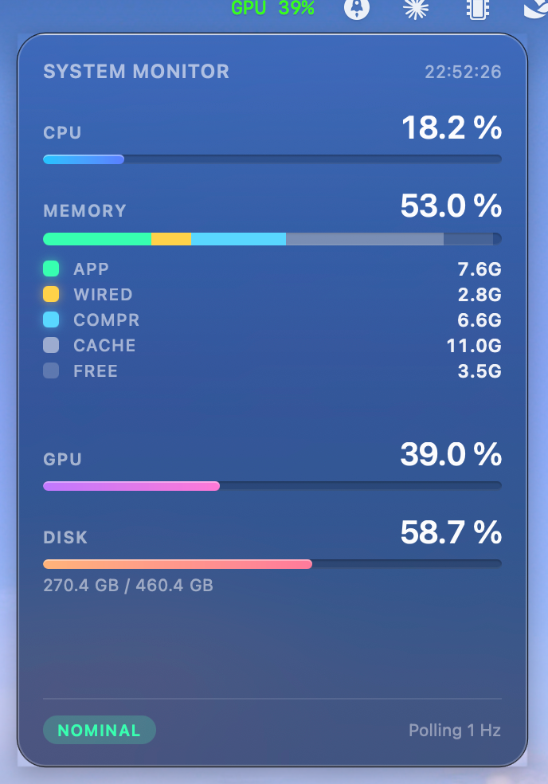
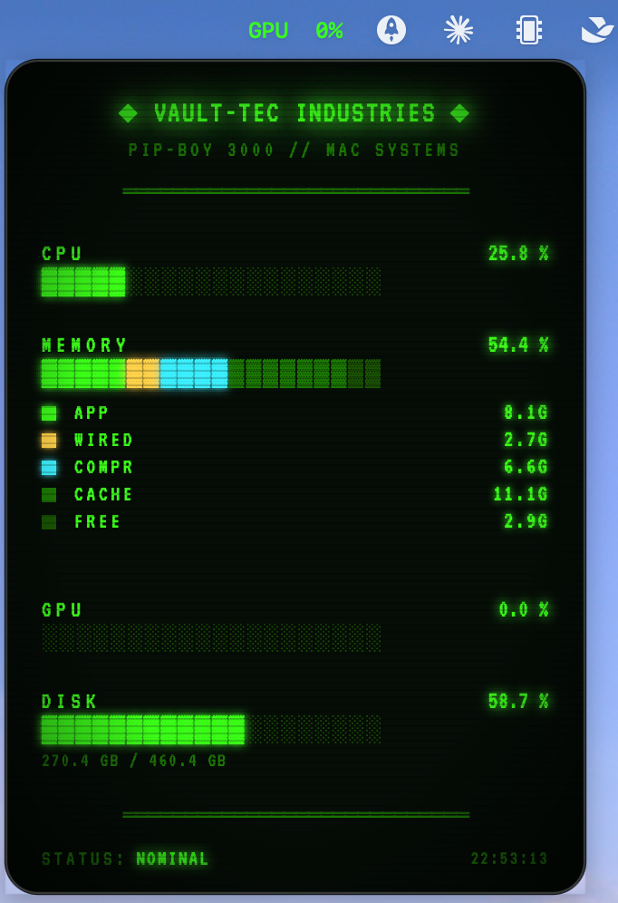
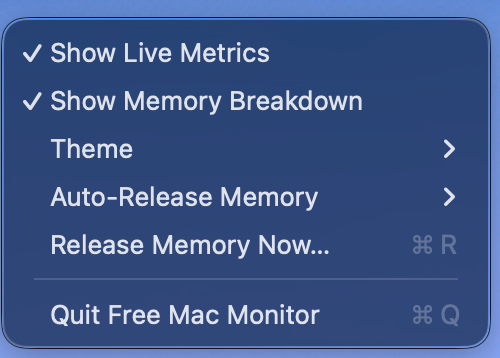

# Free Mac Monitor

[English](#english) · [中文](#中文) · [🌐 Website](https://pekinlcc.github.io/FreeMacMonitor/)

---

## English

A minimal macOS menu-bar system monitor with a retro CRT / Pip-Boy aesthetic. Pure Swift + AppKit + WebKit, zero third-party dependencies.

### Download & install

**Prebuilt universal binary** (Apple Silicon + Intel, ad-hoc signed — not notarised):

| Method | Command |
|---|---|
| One-line install | `curl -fsSL https://raw.githubusercontent.com/pekinlcc/FreeMacMonitor/main/scripts/install.sh \| bash` |
| Manual | [Download the latest release](https://github.com/pekinlcc/FreeMacMonitor/releases/latest), unzip, then drag `Free Mac Monitor.app` into `/Applications`. |

Because the app is not signed with an Apple Developer certificate, Gatekeeper will refuse to open it on first launch. Choose one:

- **Recommended** — run `xattr -cr "/Applications/Free Mac Monitor.app"` in Terminal to strip the quarantine flag, then open normally. The installer script already does this for you.
- In Finder, right-click the app and choose **Open** → **Open** in the dialog.
- Or go to **System Settings → Privacy & Security**, scroll to the blocked-app notice and click **Open Anyway**.

If you prefer building from source, see [Build & run](#build--run) below.

### Screenshots

| Liquid Glass (default) | Fallout Terminal | Right-click menu |
|---|---|---|
|  |  |  |

### Features

- **Two themes** *(v1.2)* — a Liquid Glass look (translucent `NSVisualEffectView`-backed popover, SF Pro typography, gradient pill bars) by default, and a Fallout Terminal look (VT323 CRT phosphor green, ASCII bars, scanlines). Switch via right-click → **Theme ▸**; both layouts share the same DOM and state.
- **Menu-bar indicator** — a small `>>` icon that turns red when any metric breaches its alert threshold.
- **Live-metrics mode** *(v1.0)* — right-click the icon and toggle **Show Live Metrics**. The icon becomes a rolling readout that cycles every 3 seconds through:
  ```
  CPU 20%  →  MEM 64%  →  GPU  5%  →  DSK 59%
  ```
  When a threshold is breached the rotation locks onto the offending metric and turns red, so you see the problem within one cycle.
- **Expanding panel** — left-click to open a 320 × 460 dashboard with live bar charts. Click anywhere outside to collapse.
- **Memory breakdown** *(v1.1)* — toggle **Show Memory Breakdown** and the memory bar becomes a 5-colour stacked chart (App / Wired / Compressed / Cached / Free), matching Activity Monitor's categories. Legend renders as a 5-row grid with GB values per category, never wraps.
- **Auto-release at high pressure** *(v1.1)* — when (App + Wired + Compressed) / Total ≥ 98 % for 3 consecutive seconds, optionally fire `/usr/sbin/purge` and show a live status-bar animation (`[FLUSH ▓▓▓▓] → MEM 82% ▼16`) with the real measured reduction. Three modes (right-click → **Auto-Release Memory**): Notify only / Auto-run with password prompt / Auto-run with a pre-set sudoers rule. `⌘R` from the menu triggers a one-shot release manually.
- **Always-on polling** at 1 Hz — the menu-bar state stays current whether the panel is open or not.
- **Persistent preferences** — theme, Show Live Metrics, Show Memory Breakdown, and Auto-Release mode all stored in `UserDefaults`.

### Requirements

- macOS 13 Ventura or later
- Swift 5.9+ (ships with Xcode 15 / Command Line Tools)

### Build & run

```bash
./build.sh
open "Free Mac Monitor.app"
```

If Gatekeeper blocks the unsigned build:

```bash
xattr -cr "Free Mac Monitor.app" && open "Free Mac Monitor.app"
```

### Right-click menu

| Item | Action |
|---|---|
| Show Live Metrics | Toggles the rotating readout in the menu bar. |
| Show Memory Breakdown | Switches the MEMORY row to a 5-colour stacked chart + legend. |
| Theme ▸ | Sub-menu: Liquid Glass (default) · Fallout Terminal. |
| Auto-Release Memory ▸ | Sub-menu: Notify only · Auto-run prompt password · Auto-run sudoers-free · Off. |
| Release Memory Now… ⌘R | One-shot manual purge (prompts for password unless sudoers is set up). |
| Quit Free Mac Monitor | Exits the app. |

Left-click opens / closes the dashboard panel.

### Auto-release modes

`/usr/sbin/purge` is the only honest mechanism macOS offers for explicit memory release — typically it frees 0.2–1 GB of disk cache — and it requires `root`. The three Auto-Release modes trade off between friction and automation:

1. **Notify only** *(default)* — On sustained 98 % pressure the app posts a macOS notification. You stay in control; no command runs automatically.
2. **Auto-run — prompt password** — The app fires `osascript` with `do shell script "/usr/sbin/purge" with administrator privileges`, which shows the standard admin password dialog each time.
3. **Auto-run — sudoers-free** — The app runs `sudo -n /usr/sbin/purge`. This requires a one-time sudoers rule so that no password is needed:

   ```bash
   # Run once; replace $USER with your login
   echo "$USER ALL=(root) NOPASSWD: /usr/sbin/purge" \
       | sudo tee /etc/sudoers.d/free-mac-monitor-purge > /dev/null
   sudo chmod 440 /etc/sudoers.d/free-mac-monitor-purge
   ```

Cooldown between triggers is 60 seconds; the status-bar animation shows the measured drop (`▼N`). If nothing actually got released, the app honestly displays `▼0`.

### Alert thresholds

Compiled-in constants in [`StatusBarController.swift`](Sources/FreeMacMonitor/StatusBarController.swift):

| Metric | Default |
|---|---|
| CPU  | 80% |
| Memory | 80% |
| GPU  | 80% |
| Disk | 85% |

### Regenerating the app icon

The icon is produced by a tiny Core Graphics script:

```bash
swift scripts/make_icon.swift AppIcon.iconset
iconutil -c icns AppIcon.iconset
rm -rf AppIcon.iconset
```

Output: `AppIcon.icns` at the project root, which `build.sh` copies into the bundle.

### Project layout

```
Sources/FreeMacMonitor/
  main.swift                — NSApplication bootstrap (accessory activation policy)
  AppDelegate.swift         — wires up the status bar controller
  StatusBarController.swift — status item, panel, polling, rotation + alert logic
  SystemMetrics.swift       — CPU / memory / GPU / disk sampling via Darwin + IOKit
  Resources/
    index.html / app.js / style.css — Pip-Boy dashboard UI
scripts/
  make_icon.swift           — Core Graphics icon generator
build.sh                    — SPM release build + .app assembly
Info.plist                  — LSUIElement, CFBundleIconFile, identifiers
```

### How it works

- The app runs with `LSUIElement = true` — no Dock icon, no app-switcher entry.
- A single 1 Hz timer drives both the menu-bar render and the (optional) WebKit panel update.
- The dashboard is local HTML (loaded via `WKWebView.loadFileURL`) and receives metric updates through `evaluateJavaScript` calls — simple, no IPC, no server.
- Clicking outside the open panel is caught with `NSEvent.addGlobalMonitorForEvents`, which fires only for events in other apps' windows, avoiding re-toggle races with the status-bar button click.

---

## 中文

极简的 macOS 菜单栏系统监视器，采用复古 CRT / Pip-Boy 风格。纯 Swift + AppKit + WebKit 实现，零第三方依赖。

### 下载与安装

**预编译通用二进制**（Apple Silicon + Intel，使用 ad-hoc 签名 —— 未经 Apple 公证）：

| 方式 | 命令 |
|---|---|
| 一行命令安装 | `curl -fsSL https://raw.githubusercontent.com/pekinlcc/FreeMacMonitor/main/scripts/install.sh \| bash` |
| 手动下载 | 前往 [Releases 页面](https://github.com/pekinlcc/FreeMacMonitor/releases/latest) 下载压缩包，解压后把 `Free Mac Monitor.app` 拖到 `/Applications`。 |

由于应用没有使用 Apple Developer 证书签名，首次启动时 Gatekeeper 会拒绝打开。任选其一：

- **推荐** —— 在 Terminal 中执行 `xattr -cr "/Applications/Free Mac Monitor.app"` 去除隔离标记，然后正常打开。一键安装脚本已经帮你做了这一步。
- 在 Finder 中右键应用，选择 **打开** → 在弹窗中再次点击 **打开**。
- 或前往 **系统设置 → 隐私与安全性**，滚动到被拦截的应用提示处，点击 **仍要打开**。

如果你更倾向于从源码编译，请看下方 [编译与运行](#编译与运行)。

### 截图

| Liquid Glass（默认） | Fallout Terminal | 右键菜单 |
|---|---|---|
|  |  |  |

### 功能特性

- **双主题** *（v1.2）* —— 默认 Liquid Glass 液态玻璃外观（半透明 `NSVisualEffectView` 背板 + SF Pro + 渐变 pill 柱状图）；也可切换到 Fallout Terminal（VT323 荧光绿 CRT + ASCII 柱状图 + 扫描线）。右键 → **Theme ▸** 切换，两套皮肤共用 DOM 和状态。
- **菜单栏指示器** —— 一个小小的 `>>` 图标，当任何指标突破预警阈值时会变红。
- **实时指标模式** *（v1.0）* —— 右键点击图标，切换 **Show Live Metrics**。图标会变成滚动读数，每 3 秒循环显示：
  ```
  CPU 20%  →  MEM 64%  →  GPU  5%  →  DSK 59%
  ```
  当某项指标触发阈值时，滚动会锁定在该指标并显示为红色，一个循环内就能看到问题。
- **展开面板** —— 左键点击可打开 320 × 460 仪表盘，内含实时柱状图。点击外部任意位置即可收起。
- **内存分类展示** *（v1.1）* —— 勾选 **Show Memory Breakdown** 后，内存柱会变成 5 色 stacked 条（App / Wired / Compressed / Cached / Free），与 Activity Monitor 的分类一致。图例以 5 行栅格呈现，每行"色块 · 名称 · GB 数值"，永不换行。
- **高压自动清理** *（v1.1）* —— 当 (App + Wired + Compressed) / 总内存 ≥ 98 % 持续 3 秒时，可选地调用 `/usr/sbin/purge` 并在菜单栏播放动画（`[FLUSH ▓▓▓▓] → MEM 82% ▼16`），`▼N` 是实测下降百分点。三种策略（右键 → **Auto-Release Memory**）：仅通知 / 自动运行（弹密码） / 自动运行（免密码 sudoers）。`⌘R` 立即手动触发一次清理。
- **持续轮询** —— 1 Hz 的采样频率，无论面板是否展开，菜单栏状态始终保持最新。
- **偏好持久化** —— 主题、实时指标、内存分类、自动清理模式全部存储在 `UserDefaults`。

### 系统要求

- macOS 13 Ventura 或更高版本
- Swift 5.9+（随 Xcode 15 / Command Line Tools 一并提供）

### 编译与运行

```bash
./build.sh
open "Free Mac Monitor.app"
```

如果 Gatekeeper 阻止了未签名的应用：

```bash
xattr -cr "Free Mac Monitor.app" && open "Free Mac Monitor.app"
```

### 右键菜单

| 菜单项 | 功能 |
|---|---|
| Show Live Metrics | 切换菜单栏中的滚动读数显示。 |
| Show Memory Breakdown | 将 MEMORY 行切换为 5 色 stacked 柱 + 图例。 |
| Theme ▸ | 子菜单：Liquid Glass（默认） · Fallout Terminal。 |
| Auto-Release Memory ▸ | 子菜单：仅通知 · 自动运行弹密码 · 自动运行免密码 · 关闭。 |
| Release Memory Now… ⌘R | 立即手动跑一次 purge（未配置 sudoers 免密码则弹管理员密码）。 |
| Quit Free Mac Monitor | 退出应用。 |

左键点击可展开 / 收起仪表盘面板。

### 自动清理的三种模式

macOS 上唯一诚实的显式内存释放机制是 `/usr/sbin/purge`（通常释放 0.2–1 GB 的磁盘缓存），它需要 `root` 权限。三种模式在易用性和自动化程度之间做取舍：

1. **仅通知**（默认）—— 98% 持续压力时只发送 macOS 原生通知，不会自动执行任何命令。
2. **自动运行（弹密码）** —— 通过 `osascript` 用 `do shell script "/usr/sbin/purge" with administrator privileges` 触发，每次会弹出管理员密码输入框。
3. **自动运行（免密码 sudoers）** —— 通过 `sudo -n /usr/sbin/purge` 触发。需要一次性配置 sudoers 规则：

   ```bash
   # 只需执行一次；把 $USER 替换成你的登录名
   echo "$USER ALL=(root) NOPASSWD: /usr/sbin/purge" \
       | sudo tee /etc/sudoers.d/free-mac-monitor-purge > /dev/null
   sudo chmod 440 /etc/sudoers.d/free-mac-monitor-purge
   ```

触发之间有 60 秒冷却，状态栏动画里的 `▼N` 是实测下降百分点 —— 实际没释放出来就显示 `▼0`，不会造假。

### 预警阈值

阈值定义在 [`StatusBarController.swift`](Sources/FreeMacMonitor/StatusBarController.swift) 中作为编译期常量：

| 指标 | 默认值 |
|---|---|
| CPU  | 80% |
| 内存 | 80% |
| GPU  | 80% |
| 磁盘 | 85% |

### 重新生成应用图标

图标由一个小型 Core Graphics 脚本生成：

```bash
swift scripts/make_icon.swift AppIcon.iconset
iconutil -c icns AppIcon.iconset
rm -rf AppIcon.iconset
```

输出：位于项目根目录的 `AppIcon.icns`，`build.sh` 会把它复制到应用包中。

### 项目结构

```
Sources/FreeMacMonitor/
  main.swift                — NSApplication 引导（accessory 激活策略）
  AppDelegate.swift         — 装配状态栏控制器
  StatusBarController.swift — 状态项、面板、轮询、滚动与阈值逻辑
  SystemMetrics.swift       — 通过 Darwin + IOKit 采样 CPU / 内存 / GPU / 磁盘
  Resources/
    index.html / app.js / style.css — Pip-Boy 仪表盘 UI
scripts/
  make_icon.swift           — Core Graphics 图标生成脚本
build.sh                    — SPM release 编译 + .app 组装
Info.plist                  — LSUIElement、CFBundleIconFile、标识符
```

### 实现原理

- 应用以 `LSUIElement = true` 运行 —— 无 Dock 图标，也不出现在应用切换器中。
- 单个 1 Hz 定时器同时驱动菜单栏渲染和（可选的）WebKit 面板更新。
- 仪表盘是本地 HTML（通过 `WKWebView.loadFileURL` 加载），指标更新通过 `evaluateJavaScript` 调用发送 —— 简单直接，不需要 IPC，也不需要服务器。
- 通过 `NSEvent.addGlobalMonitorForEvents` 捕获面板外的点击事件，它只会在其他应用的窗口中触发，避免了与状态栏按钮点击之间的重复切换竞态。
